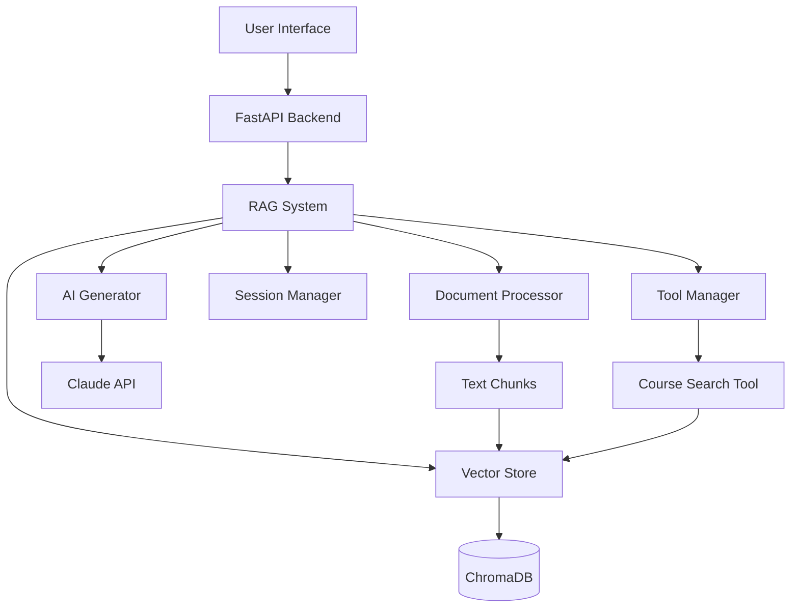
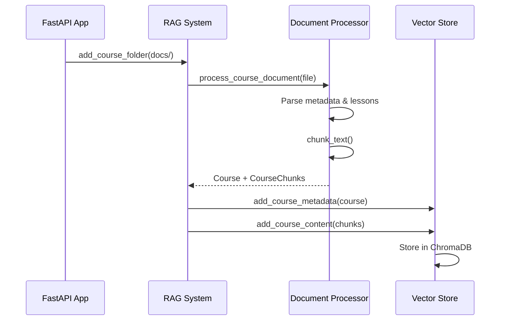
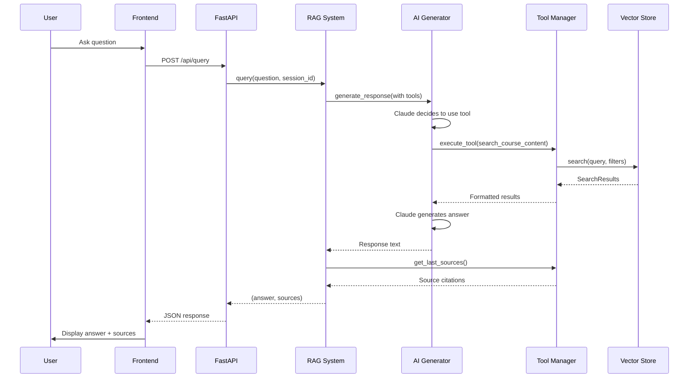

# Course Materials RAG System - Codebase Explanation

## Overview

This is a **Retrieval-Augmented Generation (RAG) system** designed to answer questions about course materials using semantic search and AI-powered responses. The application combines:

- **ChromaDB** for vector storage and semantic search
- **Anthropic's Claude** for AI-powered response generation with tool calling
- **FastAPI** backend with a clean web interface
- **Sentence Transformers** for text embeddings

## Architecture



## Project Structure

```
├── backend/                    # Python backend
│   ├── app.py                 # FastAPI application & API endpoints
│   ├── rag_system.py          # Main RAG orchestrator
│   ├── vector_store.py        # ChromaDB vector storage
│   ├── ai_generator.py        # Claude API integration
│   ├── document_processor.py  # Document parsing & chunking
│   ├── search_tools.py        # Tool-based search system
│   ├── session_manager.py     # Conversation history
│   ├── models.py              # Data models (Course, Lesson, Chunk)
│   └── config.py              # Configuration settings
├── frontend/                   # Web interface
│   ├── index.html             # Main UI
│   ├── script.js              # Frontend logic
│   └── style.css              # Styling
├── docs/                       # Course documents
│   └── course*_script.txt     # Course transcripts
└── main.py                     # Entry point (minimal)
```

## Core Components

### 1. RAG System ([`backend/rag_system.py`](backend/rag_system.py))

**Purpose**: Main orchestrator that coordinates all components

**Key Methods**:
- [`add_course_document()`](backend/rag_system.py:27-50) - Process and add a single course
- [`add_course_folder()`](backend/rag_system.py:52-100) - Batch process multiple courses
- [`query()`](backend/rag_system.py:102-140) - Handle user queries with tool-based search
- [`get_course_analytics()`](backend/rag_system.py:142-147) - Get course statistics

**Workflow**:
1. Initializes all subsystems (document processor, vector store, AI generator, session manager, tools)
2. Processes documents into structured course data
3. Handles queries by coordinating between AI and search tools
4. Manages conversation context via session manager

### 2. Vector Store ([`backend/vector_store.py`](backend/vector_store.py))

**Purpose**: Manages semantic search using ChromaDB with two collections

**Collections**:
- `course_catalog` - Course metadata (titles, instructors, lesson info)
- `course_content` - Actual course content chunks

**Key Features**:
- [`search()`](backend/vector_store.py:61-100) - Unified search interface with course/lesson filtering
- [`_resolve_course_name()`](backend/vector_store.py:102-116) - Fuzzy course name matching via vector search
- [`add_course_metadata()`](backend/vector_store.py:135-160) - Store course info with lesson links
- [`add_course_content()`](backend/vector_store.py:162-180) - Store content chunks with metadata

**Smart Features**:
- Semantic course name resolution (e.g., "MCP" matches "MCP: Build Rich-Context AI Apps")
- Lesson-specific filtering
- Link tracking for courses and individual lessons

### 3. AI Generator ([`backend/ai_generator.py`](backend/ai_generator.py))

**Purpose**: Interfaces with Claude API for response generation

**Key Features**:
- Tool calling support (up to 2 rounds via [`MAX_TOOL_ROUNDS`](backend/ai_generator.py:7))
- Conversation history integration
- Specialized system prompt for educational content
- [`_execute_tool_round()`](backend/ai_generator.py:105-136) - Handles tool execution loop

**System Prompt Strategy**:
- Emphasizes brief, concise, educational responses
- Limits searches to 2 per query
- Instructs model to avoid meta-commentary
- Differentiates between general knowledge and course-specific queries

### 4. Document Processor ([`backend/document_processor.py`](backend/document_processor.py))

**Purpose**: Parses course documents and creates text chunks

**Document Format Expected**:
```
Course Title: [title]
Course Link: [url]
Course Instructor: [name]

Lesson 0: [title]
Lesson Link: [url]
[content...]

Lesson 1: [title]
Lesson Link: [url]
[content...]
```

**Key Methods**:
- [`process_course_document()`](backend/document_processor.py:97-259) - Extract course structure
- [`chunk_text()`](backend/document_processor.py:25-91) - Sentence-based chunking with overlap

**Chunking Strategy**:
- Sentence-based splitting (preserves semantic units)
- Configurable chunk size (800 chars) and overlap (100 chars)
- Adds lesson context to chunks for better retrieval

### 5. Search Tools ([`backend/search_tools.py`](backend/search_tools.py))

**Purpose**: Implements tool-based search for Claude

**Architecture**:
- [`Tool`](backend/search_tools.py:6-17) - Abstract base class
- [`CourseSearchTool`](backend/search_tools.py:20-118) - Concrete search implementation
- [`ToolManager`](backend/search_tools.py:120-158) - Tool registry and executor

**Tool Definition**:
```python
{
    "name": "search_course_content",
    "description": "Search course materials...",
    "input_schema": {
        "properties": {
            "query": "What to search for",
            "course_name": "Optional course filter",
            "lesson_number": "Optional lesson filter"
        }
    }
}
```

**Source Tracking**:
- Captures sources from searches
- Includes lesson links when available
- Returns formatted citations to frontend

### 6. Session Manager ([`backend/session_manager.py`](backend/session_manager.py))

**Purpose**: Manages conversation history per session

**Features**:
- Session creation with unique IDs
- Message history with role tracking (user/assistant)
- Automatic history truncation (keeps last 2 exchanges via [`MAX_HISTORY`](backend/config.py:22))
- Session clearing for new conversations

### 7. FastAPI Application ([`backend/app.py`](backend/app.py))

**Purpose**: HTTP API and static file serving

**Endpoints**:
- `POST /api/query` - Process user queries
- `DELETE /api/session/{session_id}` - Clear conversation
- `GET /api/courses` - Get course statistics

**Features**:
- CORS enabled for development
- Automatic document loading on startup
- Static file serving for frontend
- No-cache headers for development

### 8. Data Models ([`backend/models.py`](backend/models.py))

**Purpose**: Pydantic models for type safety

**Models**:
- [`Lesson`](backend/models.py:4-8) - Lesson metadata with optional link
- [`Course`](backend/models.py:10-15) - Course with lessons list
- [`CourseChunk`](backend/models.py:17-22) - Text chunk with metadata

## Frontend Architecture

### User Interface ([`frontend/index.html`](frontend/index.html))

**Layout**:
- Left sidebar with course stats and suggested questions
- Main chat area with message history
- Input field with send button

**Features**:
- Collapsible sections for courses and suggestions
- Markdown rendering via marked.js
- Responsive design

### JavaScript Logic ([`frontend/script.js`](frontend/script.js))

**Key Functions**:
- [`sendMessage()`](frontend/script.js:49-100) - Handle user input and API calls
- [`addMessage()`](frontend/script.js) - Render messages with markdown
- [`loadCourseStats()`](frontend/script.js) - Fetch and display course info
- [`handleNewChat()`](frontend/script.js) - Clear session and start fresh

**State Management**:
- Tracks current session ID
- Manages loading states
- Handles errors gracefully

## Configuration ([`backend/config.py`](backend/config.py))

**Settings**:
- `ANTHROPIC_API_KEY` - Claude API key (from .env)
- `ANTHROPIC_MODEL` - Model version (default: claude-sonnet-4-6)
- `EMBEDDING_MODEL` - Sentence transformer model (all-MiniLM-L6-v2)
- `CHUNK_SIZE` - 800 characters
- `CHUNK_OVERLAP` - 100 characters
- `MAX_RESULTS` - 5 search results
- `MAX_HISTORY` - 2 conversation exchanges
- `CHROMA_PATH` - ./chroma_db

## Data Flow

### Document Ingestion Flow



### Query Processing Flow



## Key Design Patterns

### 1. Tool-Based Search
Instead of directly injecting search results into prompts, the system uses Claude's tool calling:
- Claude decides when to search
- Can perform multiple searches (up to 2)
- More natural conversation flow
- Better handling of general vs. specific questions

### 2. Two-Collection Strategy
Separates course metadata from content:
- **Catalog**: Fast course name resolution
- **Content**: Efficient content search with filters
- Enables fuzzy course matching

### 3. Sentence-Based Chunking
Preserves semantic meaning:
- Splits on sentence boundaries
- Maintains context with overlap
- Adds lesson context to first chunk

### 4. Session Management
Maintains conversation context:
- Tracks user-assistant exchanges
- Automatic history truncation
- Session isolation

## Running the Application

### Setup
```bash
# Install dependencies
uv sync

# Configure API key
cp .env.example .env
# Edit .env and add your ANTHROPIC_API_KEY

# Run the application
./run.sh
# OR
cd backend && uv run uvicorn app:app --reload --port 8000
```

### Access
- Web Interface: http://localhost:8000
- API Docs: http://localhost:8000/docs

## Example Queries

The system handles various query types:

1. **Course Discovery**: "What courses are available?"
2. **Course Content**: "What is covered in the MCP course?"
3. **Specific Lessons**: "What was covered in lesson 5 of the MCP course?"
4. **Topic Search**: "Are there any courses about RAG?"
5. **General Knowledge**: "What is RAG?" (answered without search)

## Technology Stack

- **Backend**: Python 3.13+, FastAPI, Uvicorn
- **AI**: Anthropic Claude (claude-sonnet-4-6)
- **Vector DB**: ChromaDB 1.0.15
- **Embeddings**: Sentence Transformers (all-MiniLM-L6-v2)
- **Frontend**: Vanilla JavaScript, HTML, CSS
- **Package Manager**: uv

## Key Strengths

1. **Smart Course Matching**: Semantic search for course names
2. **Tool-Based Architecture**: Claude decides when to search
3. **Lesson-Level Granularity**: Can filter by specific lessons
4. **Source Citations**: Provides links to original content
5. **Conversation Context**: Maintains session history
6. **Incremental Loading**: Avoids re-processing existing courses
7. **Clean Separation**: Backend/frontend decoupling

## Potential Improvements

1. **Multi-file Support**: Currently only handles .txt files
2. **Advanced Chunking**: Could use semantic chunking strategies
3. **Caching**: Add prompt caching for cost reduction
4. **Authentication**: No user authentication currently
5. **Persistence**: Sessions are in-memory only
6. **Testing**: Limited test coverage
7. **Monitoring**: No logging/analytics infrastructure

## Summary

This is a well-architected RAG system that demonstrates modern AI application patterns:
- Clean component separation
- Tool-based AI interaction
- Semantic search with filtering
- Conversation management
- User-friendly interface

The codebase is production-ready for educational content Q&A with room for enhancement in areas like authentication, persistence, and monitoring.